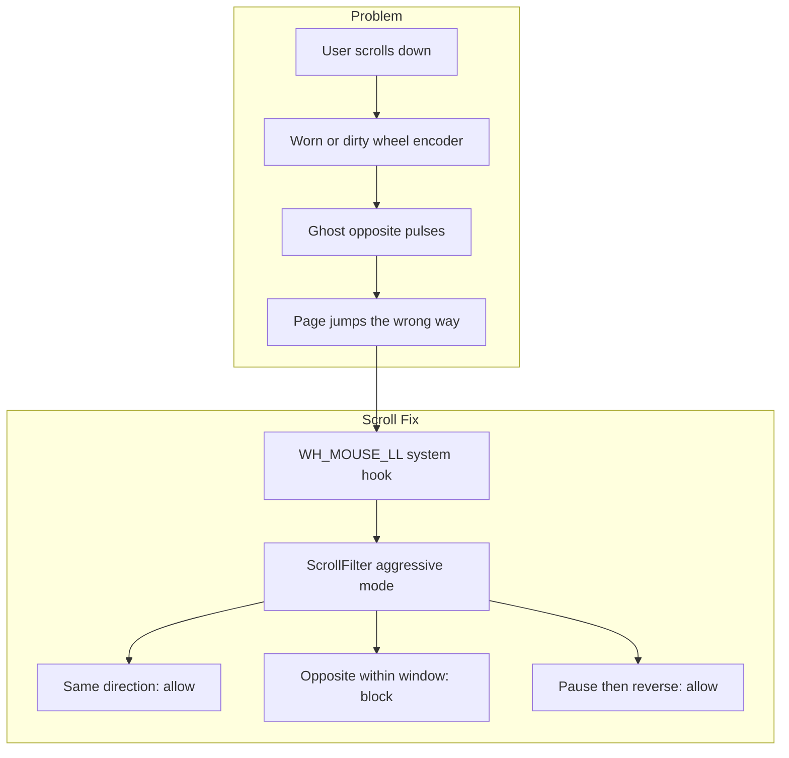
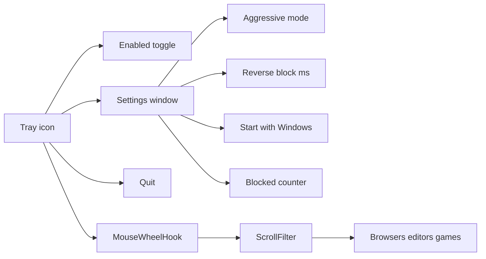
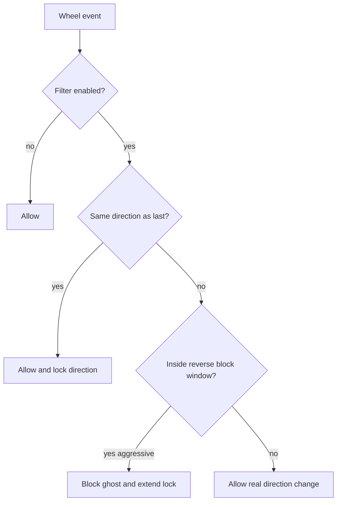

# Scroll Fix

Software fix for mouse scroll wheels that occasionally jump in the **wrong direction** (classic worn/dirty rotary encoder glitch). Built for Windows — useful with Cooler Master and many other gaming mice.

When you scroll down and the page sometimes ticks upward (or the reverse), Scroll Fix intercepts those ghost events and drops them before apps see them.

## Problem → solution roadmap



### Site map of the app



### Decision flow inside the filter



## Features

- Global low-level mouse wheel hook (works in browsers, editors, games in windowed mode, etc.)
- Aggressive mode by default for worn encoders
- Tunable reverse-block window
- System tray icon (enable/disable, settings, quit)
- Optional start with Windows
- Counter of blocked ghost scrolls
- Single `.exe` (no Cooler Master software required)

## Hardware tip (try this first)

The root cause is usually dust or wear on the wheel encoder:

1. Hold the mouse upside down.
2. Blow compressed air into the gaps beside the scroll wheel while spinning it.
3. Optional: electronics **contact cleaner** (not regular WD-40) on the encoder, spin for ~30–60s, let dry fully.

If cleaning helps only for a few minutes, the encoder is worn — keep using Scroll Fix, RMA if under warranty, or replace the encoder later.

## Requirements

- Windows 10/11
- [.NET 8 SDK](https://dotnet.microsoft.com/download/dotnet/8.0) to build (runtime needed if not self-contained)

## Build & run

```bat
dotnet build ScrollFix.sln -c Release
dotnet run --project src\ScrollFix -c Release
```

Or publish a portable exe:

```bat
dotnet publish src\ScrollFix -c Release -r win-x64 --self-contained false -p:PublishSingleFile=true -o publish
publish\ScrollFix.exe
```

A green tray icon appears near the clock. Right-click:

- **Enabled** — toggle the filter
- **Settings…** — tweak thresholds and autostart
- **Quit**

## Tests

```bat
dotnet test ScrollFix.sln
```

## Settings

| Setting | Default | Meaning |
|--------|---------|---------|
| Aggressive mode | on | Opposite scrolls inside the window are always blocked |
| Reverse block window (ms) | 220 | How long opposite scrolls are treated as ghosts |
| Max ghost notches | 2 | Used only in mild mode |
| Confirm direction count | 3 | Used only in mild mode |

To reverse on purpose in aggressive mode, pause briefly (~0.2s) then scroll the other way. If ghosts still leak, raise the window to 300 ms. If reversals feel sticky, lower it to 160–180 ms.

Settings file:

`%LOCALAPPDATA%\ScrollFix\settings.json`

## Project layout

```text
scroll-fix/
├── ScrollFix.sln
├── src/ScrollFix/          # tray app + hook + filter
├── src/ScrollFix.Tests/    # unit tests
├── publish/                # optional local build output (gitignored)
└── README.md
```

## License

MIT — see [LICENSE](LICENSE).
