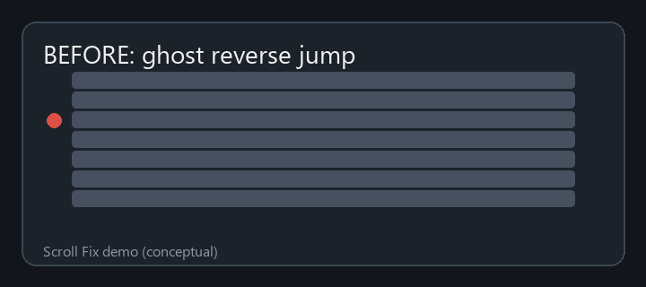
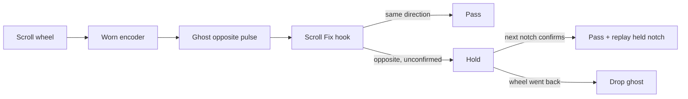

# Scroll Fix

[](https://github.com/Leozz18/scroll-fix/actions/workflows/build.yml)
[](https://github.com/Leozz18/scroll-fix/releases/latest)
[](https://github.com/Leozz18/scroll-fix/releases)
[](LICENSE)

**Fix a mouse scroll wheel that jumps the wrong way on Windows.**

If your wheel scrolls down and sometimes ticks **up** (or the reverse), that is almost always a worn or dirty rotary encoder, not your browser. Scroll Fix is a tiny tray app that recognises those ghost pulses and drops them before any application sees them, while keeping fast, intentional direction changes responsive.



## Download

Grab one file from the [latest release](https://github.com/Leozz18/scroll-fix/releases/latest) and run it. No installer.

| File | Size | Needs |
|------|------|-------|
| `ScrollFix.exe` | ~0.3 MB | [.NET 8 Desktop Runtime](https://dotnet.microsoft.com/download/dotnet/8.0) (Windows offers to install it on first run) |
| `ScrollFix-standalone.exe` | ~70 MB | nothing |

A green icon appears in the tray near the clock. Right-click it for **Enabled**, **Pause for 10 minutes**, **Settings…**, **Quit**.

Works with any mouse (Cooler Master, Logitech, Razer, Glorious, …) because it filters at the Windows input layer, not through vendor software.

## How it works



Scroll Fix installs a low-level mouse hook (`WH_MOUSE_LL`) and looks at the direction and timing of each wheel notch.

### Rule 0: impossible reversals are bursts

A hand cannot reverse a detented wheel in under ~40 ms, but a worn encoder happily fires 2–4 opposite pulses within the same millisecond. Any opposite notch closer than the *minimum reversal gap* (40 ms) to the previous wheel event is dropped on the spot, in both modes. This single rule removed 90 % of the wrong-way notches on a real trace of a badly worn wheel.

### Balanced mode (default)

The first notch that goes against the current direction inside the *block window* (220 ms) is **held**, not delivered.

- If the **next** notch goes the same new way, the reversal is real: that notch passes and the held one is re-injected. You lose nothing, at the cost of one notch of latency on direction changes.
- If the next notch goes **back** to the original direction, the held notch was a ghost and is dropped.

This is what makes rapid up/down/up/down scrolling feel normal while ghosts still disappear.

### Strict mode

Every opposite notch inside the window is dropped and the window is extended while ghosts keep firing. Choose this if ghosts still leak through in Balanced mode: on a heavily worn wheel it brought wrong-way notches from 9 to **0** per 6 minutes of scrolling. Reversing on purpose then requires a short pause (about the window length). If Scroll Fix blocks 30+ ghosts in ten minutes while in Balanced mode, it suggests this preset once from the tray.

### Presets

| Preset | Mode | Window | Min. reversal gap | Use when |
|--------|------|--------|-------------------|----------|
| Balanced (default) | Balanced | 220 ms | 40 ms | Most worn wheels |
| Quick reverse | Balanced | 160 ms | 30 ms | Gaming, timeline scrubbing, rapid up/down |
| Worn encoder | Strict | 260 ms | 50 ms | Ghosts still leak through, or they come in bursts |

Optional: *Drop same-direction duplicates* removes a second same-direction pulse arriving within a few ms of the previous one (encoders that fire twice per detent make scrolling feel uneven). Off by default.

Settings live in `%LOCALAPPDATA%\ScrollFix\settings.json`.

### Diagnostics

Tray → **Diagnostics → Log wheel events** writes every notch (time, delta, decision) to `%LOCALAPPDATA%\ScrollFix\wheel-trace.log`. Attach it to a bug report; it is what the thresholds above were tuned on.

## FAQ

**Does this work with my Razer / Logitech / whatever mouse?**
Yes. It filters Windows wheel events, so the brand does not matter.

**Isn't the real fix to replace the encoder?**
Yes, if you can solder, a new encoder is the permanent fix. Scroll Fix is for everyone else: no tools, no warranty void, ten seconds to set up. It also buys time while you decide whether to RMA or replace the mouse.

**Will it slow down my scrolling?**
Same-direction scrolling is untouched. In Balanced mode a direction change is delivered one notch late (tens of milliseconds); in Strict mode you need a short pause before reversing.

**Why is the standalone exe so big?**
It bundles the whole .NET runtime so it runs on a clean machine. Use the small `ScrollFix.exe` if you already have .NET 8, Windows will offer to install it otherwise.

**Antivirus flagged it.**
Unsigned executables that install global mouse hooks sometimes trip heuristics. The source is here, the build is reproducible with the commands below, and every release ships a `SHA256SUMS.txt`.

**Try this first (hardware).**
Turn the mouse upside down and blow compressed air into the gaps beside the wheel while spinning it. Electronics contact cleaner (not regular WD-40) helps with oxidised contacts. If it only helps for minutes, the encoder is worn; keep Scroll Fix running.

## Build from source

Requires the [.NET 8 SDK](https://dotnet.microsoft.com/download/dotnet/8.0).

```bat
dotnet test ScrollFix.sln
dotnet publish src\ScrollFix -c Release -r win-x64 --self-contained false -p:PublishSingleFile=true -o publish
dotnet publish src\ScrollFix -c Release -r win-x64 --self-contained true  -p:PublishSingleFile=true -o publish-standalone
```

Pushing a `v*` tag makes GitHub Actions build both executables, write `SHA256SUMS.txt` and attach everything to the release.

## Project layout

```text
scroll-fix/
├── src/ScrollFix/            tray app, hook, filter, settings UI
├── src/ScrollFix.Tests/      xunit tests with a fake clock
├── docs/                     roadmap, demo assets, outreach notes
└── .github/workflows/        CI: test on push, release assets on tag
```

More diagrams and the roadmap: [docs/ROADMAP.md](docs/ROADMAP.md). Changes per version: [CHANGELOG.md](CHANGELOG.md).

## License

MIT, see [LICENSE](LICENSE).
