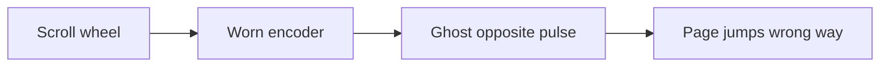
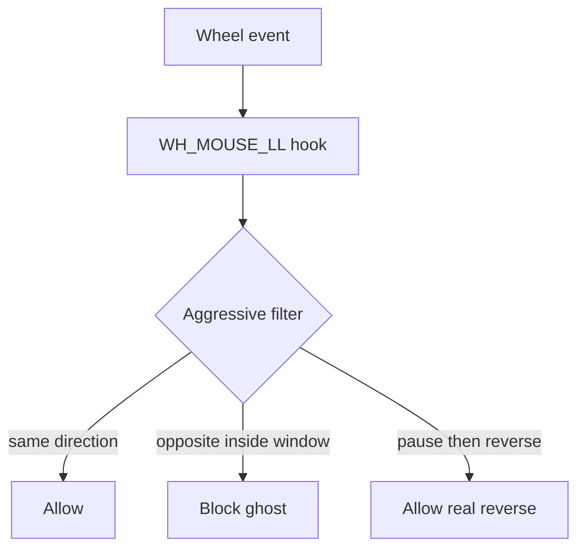

# Scroll Fix

[](https://github.com/Leozz18/scroll-fix/releases)
[](LICENSE)
[](https://github.com/Leozz18/scroll-fix/releases)

**Fix mouse scroll wheel jumping the wrong way on Windows.**

If your wheel scrolls down and sometimes ticks **up** (or the reverse), that is usually a worn/dirty rotary encoder — not your browser. Scroll Fix is a tiny tray app that blocks those ghost pulses.


## Download (no build needed)

1. Grab **`ScrollFix.exe`** from the [latest release](https://github.com/Leozz18/scroll-fix/releases/latest)
2. Run it
3. Look for the green tray icon near the clock

Right-click tray → **Enabled** / **Settings…** / **Quit**

Works with Cooler Master, Logitech, Razer, and most other mice with mechanical scroll encoders.

## Why this happens



Cleaning with compressed air can help for a while. When the encoder is worn, software filtering is the practical fix.

## How Scroll Fix works



Default **Aggressive mode** blocks any opposite notch within ~220 ms and extends the lock during ghost bursts. Pause briefly (~0.2s) when you intentionally reverse direction.

More diagrams: [docs/ROADMAP.md](docs/ROADMAP.md)

## Features

- Global low-level mouse hook (browsers, editors, windowed games, …)
- Aggressive mode tuned for worn encoders
- Adjustable reverse-block window
- Tray icon + settings + optional start with Windows
- Counter of blocked ghost scrolls
- Single portable `.exe` (self-contained .NET)

## Settings

| Setting | Default | Meaning |
|--------|---------|---------|
| Aggressive mode | on | Opposite scrolls inside the window are always blocked |
| Reverse block window (ms) | 220 | How long opposite scrolls count as ghosts |

If ghosts still leak → raise to **300 ms**. If intentional reverses feel sticky → lower to **160–180 ms**.

Settings file: `%LOCALAPPDATA%\ScrollFix\settings.json`

## Build from source

Requires [.NET 8 SDK](https://dotnet.microsoft.com/download/dotnet/8.0).

```bat
dotnet test ScrollFix.sln
dotnet publish src\ScrollFix -c Release -r win-x64 --self-contained true -p:PublishSingleFile=true -o publish
```

## Hardware tip

1. Blow compressed air into the gaps beside the wheel while spinning it
2. Optional: electronics contact cleaner (not regular WD-40), spin 30–60s, let dry
3. If it only helps for minutes, keep using Scroll Fix (or RMA / replace the encoder)

## Project layout

```text
scroll-fix/
├── src/ScrollFix/           # tray app + hook + filter
├── src/ScrollFix.Tests/
├── docs/ROADMAP.md
└── README.md
```

## License

MIT — see [LICENSE](LICENSE).
