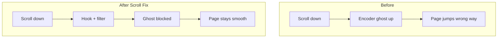

# Problem → solution roadmap

Visual companion to the README. Same story as the diagrams on GitHub, expanded for planning and onboarding.

## 1. Symptom

Scrolling down (or up) sometimes inserts a short jump in the **opposite** direction. It feels like the page “hiccups.”

## 2. Root cause

Mechanical rotary encoders on many gaming mice (including Cooler Master models) wear out or collect dust. They emit **ghost pulses** with the wrong direction pattern.

```text
Physical wheel → encoder contacts → USB HID reports → Windows → apps
                      ↑
                 dirt / wear here
```

Cleaning can help temporarily. Permanent hardware fix = replace encoder / RMA. Software fix = filter ghosts before apps see them.

## 3. Solution architecture

| Layer | Component | Job |
|-------|-----------|-----|
| OS hook | `MouseWheelHook` | Capture `WM_MOUSEWHEEL` via `WH_MOUSE_LL` |
| Logic | `ScrollFilter` | Decide allow vs block |
| UI | `TrayAppContext` + `SettingsForm` | Enable, tune, autostart |
| Persist | `AppSettings` | `%LOCALAPPDATA%\ScrollFix\settings.json` |

## 4. Roadmap status

- [x] Diagnose encoder ghost-scroll behavior
- [x] Global low-level mouse hook on Windows
- [x] Aggressive filter (block opposite inside time window)
- [x] Tray UI + settings + autostart
- [x] Unit tests for filter decisions
- [x] Publish single-file `ScrollFix.exe`
- [ ] Optional: per-device filtering (only Cooler Master VID/PID)
- [ ] Optional: live ghost graph in settings
- [ ] Optional: installer / signed release on GitHub Releases

## 5. Mermaid overview


