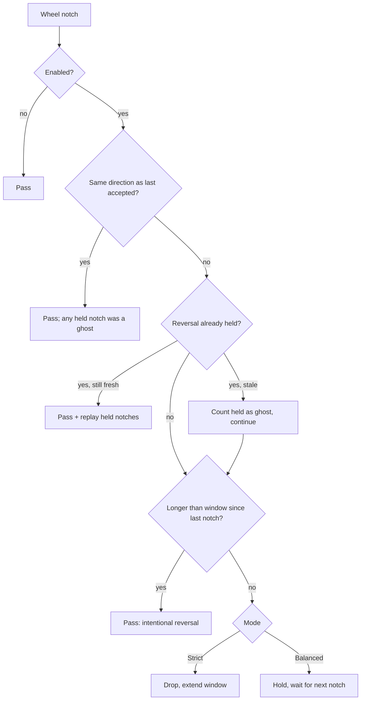
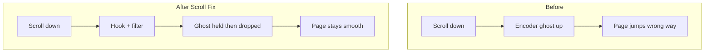

# Problem → solution roadmap

Visual companion to the README. Same story as the diagrams on GitHub, expanded for planning and onboarding.

## 1. Symptom

Scrolling down (or up) sometimes inserts a short jump in the **opposite** direction. It feels like the page "hiccups".

## 2. Root cause

Mechanical rotary encoders on many gaming mice (Cooler Master, Logitech, Razer, …) wear out or collect dust. They emit **ghost pulses** with the wrong direction pattern.

```text
Physical wheel → encoder contacts → USB HID reports → Windows → apps
                      ↑
                 dirt / wear here
```

Cleaning can help temporarily. Permanent hardware fix = replace encoder / RMA. Software fix = filter ghosts before apps see them.

## 3. Solution architecture

| Layer | Component | Job |
|-------|-----------|-----|
| OS hook | `MouseWheelHook` | Capture `WM_MOUSEWHEEL` via `WH_MOUSE_LL`; re-inject held notches with a marker so they are never filtered twice |
| Logic | `ScrollFilter` | Pure, clock-injectable decision engine (Balanced / Strict) |
| UI | `TrayAppContext` + `SettingsForm` | Enable, pause, presets, autostart; UI timer owns all disk writes |
| Persist | `AppSettings` | `%LOCALAPPDATA%\ScrollFix\settings.json`, atomic writes, v1.0 migration |
| Delivery | GitHub Actions | Test on push, two exes + SHA256SUMS on tag |

## 4. Filter decision flow (Balanced)



## 5. Roadmap status

- [x] Diagnose encoder ghost-scroll behaviour
- [x] Global low-level mouse hook on Windows
- [x] Strict filter (block opposite inside time window)
- [x] Tray UI + settings + autostart
- [x] Unit tests for filter decisions
- [x] Publish single-file `ScrollFix.exe`
- [x] v1.1: Balanced mode with hold / confirm / replay (rapid reversals work)
- [x] v1.1: presets, pause, icon, CI, two release assets
- [ ] Per-device filtering (only a chosen VID/PID)
- [ ] Live ghost timeline in Settings (last 10 s of notches)
- [ ] Horizontal wheel support (rare on worn tilt wheels)
- [ ] Code-signed releases / winget package

## 6. Before / after


